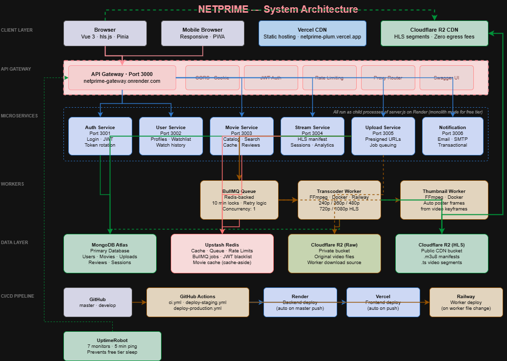
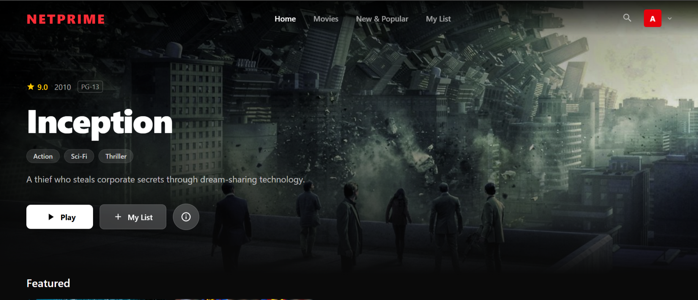
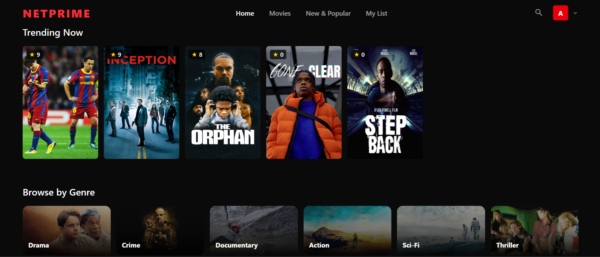
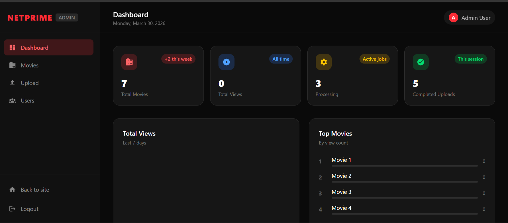
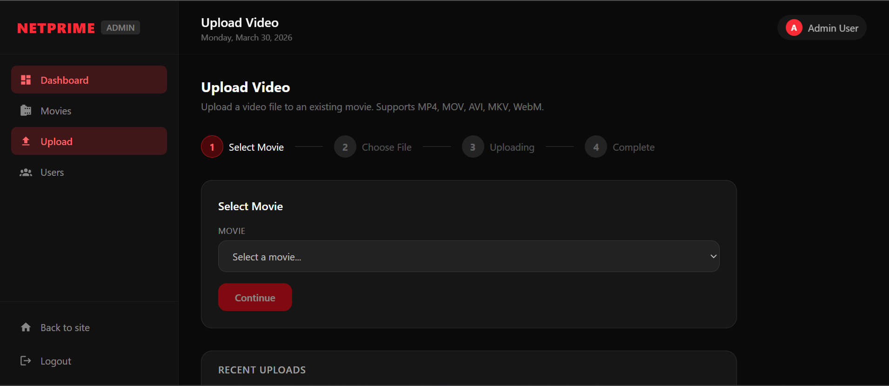

# NETPRIME 🎬

> A production-grade movie streaming platform built with a microservices architecture, HLS adaptive bitrate streaming, and a modern Vue 3 frontend. Built from scratch as a deep system design exercise.

**Live:** [netprime-plum.vercel.app](https://netprime-plum.vercel.app) · **API Docs:** [netprime-gateway.onrender.com/api-docs](https://netprime-gateway.onrender.com/api-docs)

---

## Table of Contents

- [NETPRIME 🎬](#netprime-)
  - [Table of Contents](#table-of-contents)
  - [Overview](#overview)
  - [Architectural Design](#architectural-design)
  - [Architecture](#architecture)
  - [Tech Stack](#tech-stack)
    - [Backend](#backend)
    - [Frontend](#frontend)
    - [Infrastructure](#infrastructure)
  - [Features](#features)
    - [User Features](#user-features)
    - [Admin Features](#admin-features)
    - [Technical Features](#technical-features)
  - [Screenshots](#screenshots)
    - [Home Page](#home-page)
    - [Movie Detail](#movie-detail)
    - [Admin Console](#admin-console)
    - [Admin Console](#admin-console-1)
  - [Services](#services)
  - [Getting Started](#getting-started)
    - [Prerequisites](#prerequisites)
    - [Installation](#installation)
    - [Running Locally](#running-locally)
  - [Environment Variables](#environment-variables)
  - [API Documentation](#api-documentation)
    - [Key Endpoints](#key-endpoints)
  - [CI/CD Pipeline](#cicd-pipeline)
  - [Deployment](#deployment)
    - [Infrastructure Notes](#infrastructure-notes)
  - [Project Structure](#project-structure)
  - [System Design Concepts Implemented](#system-design-concepts-implemented)
  - [License](#license)

---

## Overview

Netprime is a full-stack streaming platform inspired by Netflix. It supports video upload, automated HLS transcoding into multiple quality levels (240p → 1080p), adaptive bitrate playback, JWT authentication with refresh token rotation, role-based access control, and a complete admin console.

The project was designed specifically to practice real-world system design concepts — microservices, event-driven architecture, distributed job queuing, CDN integration, and cloud-native deployment.

---

## Architectural Design



---

## Architecture

```
                         ┌─────────────────┐
                         │   Vue 3 Frontend │
                         │  (Vercel CDN)    │
                         └────────┬────────┘
                                  │ HTTPS
                         ┌────────▼────────┐
                         │   API Gateway   │  ← Single entry point
                         │   Port 3000     │  ← CORS, Auth, Rate limiting
                         └────────┬────────┘
                                  │
              ┌───────────────────┼───────────────────┐
              │                   │                   │
    ┌─────────▼──────┐  ┌────────▼───────┐  ┌───────▼────────┐
    │  Auth Service  │  │  Movie Service │  │  User Service  │
    │  Port 3001     │  │  Port 3003     │  │  Port 3002     │
    └────────────────┘  └────────────────┘  └────────────────┘
              │                   │                   │
    ┌─────────▼──────┐  ┌────────▼───────┐  ┌───────▼────────┐
    │ Stream Service │  │ Upload Service │  │  Notification  │
    │  Port 3004     │  │  Port 3005     │  │  Port 3006     │
    └────────────────┘  └────────────────┘  └────────────────┘
                                  │
                         ┌────────▼────────┐
                         │  BullMQ Queue   │  ← Redis-backed job queue
                         └────────┬────────┘
                                  │
                         ┌────────▼────────┐
                         │Transcoder Worker│  ← FFmpeg HLS transcoding
                         │  (Railway)      │
                         └────────┬────────┘
                                  │
              ┌───────────────────┼───────────────────┐
              │                   │                   │
    ┌─────────▼──────┐  ┌────────▼───────┐  ┌───────▼────────┐
    │  MongoDB Atlas │  │  Upstash Redis │  │ Cloudflare R2  │
    │  (Database)    │  │  (Cache/Queue) │  │ (Video Storage)│
    └────────────────┘  └────────────────┘  └────────────────┘
```

---

## Tech Stack

### Backend
| Technology        | Purpose                                    |
| ----------------- | ------------------------------------------ |
| Node.js / Express | Microservices runtime                      |
| MongoDB Atlas     | Primary database                           |
| Upstash Redis     | Caching, rate limiting, job queue          |
| BullMQ            | Distributed job queue for transcoding      |
| FFmpeg            | Video transcoding to HLS format            |
| Cloudflare R2     | Video storage + CDN delivery               |
| JWT (RS256)       | Authentication with refresh token rotation |
| Winston           | Structured logging                         |

### Frontend
| Technology      | Purpose                       |
| --------------- | ----------------------------- |
| Vue 3 + Vite    | Frontend framework            |
| Pinia           | State management              |
| Vue Router      | Client-side routing           |
| Tailwind CSS v4 | Styling                       |
| hls.js          | HLS video playback            |
| Axios           | HTTP client with interceptors |

### Infrastructure
| Technology     | Purpose                              |
| -------------- | ------------------------------------ |
| Render         | Backend hosting                      |
| Vercel         | Frontend hosting + CDN               |
| Railway        | Worker hosting (Docker + FFmpeg)     |
| GitHub Actions | CI/CD pipeline                       |
| Docker         | Containerisation                     |
| NGINX          | Reverse proxy + load balancer config |
| UptimeRobot    | Service uptime monitoring            |

---

## Features

### User Features
- Browse movies by genre, trending, and new releases
- HLS adaptive bitrate video streaming (quality auto-adjusts to connection speed)
- Manual quality selection (240p / 360p / 480p / 720p / 1080p)
- Watchlist management
- Watch history with resume playback
- Movie reviews and ratings
- User profile and subscription management
- Responsive design (mobile, tablet, desktop)

### Admin Features
- Full admin console dashboard
- Video upload with chunked multipart to Cloudflare R2
- Automatic background transcoding (BullMQ + FFmpeg)
- Movie management (publish, draft, feature)
- User management with subscription control
- Analytics (views, trending, genre breakdown)

### Technical Features
- JWT access tokens (15 min) + httpOnly refresh tokens (7 days)
- Refresh token rotation with reuse detection
- Per-user and per-IP rate limiting via Redis
- Redis caching for movie queries (cache-aside pattern)
- Stateless microservices (horizontally scalable)
- Background job processing with lock renewal and retry logic
- CDN-served HLS segments via Cloudflare R2 public bucket
- CORS configured for cross-domain cookie support (`sameSite: none`, `secure: true`)

---

## Screenshots

### Home Page


### Movie Detail


### Admin Console


### Admin Console


---

## Services

| Service              | Port | Responsibility                                                             |
| -------------------- | ---- | -------------------------------------------------------------------------- |
| API Gateway          | 3000 | Request routing, auth middleware, CORS, rate limiting                      |
| Auth Service         | 3001 | Registration, login, JWT issuance, token refresh, password reset           |
| User Service         | 3002 | User profiles, watchlist, watch history, subscriptions                     |
| Movie Service        | 3003 | Movie CRUD, search, genres, trending, reviews                              |
| Stream Service       | 3004 | Stream session management, HLS manifest serving, analytics                 |
| Upload Service       | 3005 | Multipart upload orchestration, R2 presigned URLs, job queuing             |
| Notification Service | 3006 | Email notifications via SMTP (welcome, password reset, transcode complete) |
| Transcoder Worker    | —    | FFmpeg HLS transcoding, quality profiling, R2 upload                       |
| Thumbnail Worker     | —    | Automatic thumbnail generation from video frames                           |

---

## Getting Started

### Prerequisites
- Node.js 20+
- MongoDB Atlas account
- Upstash Redis account
- Cloudflare R2 account
- FFmpeg installed (Windows: add to PATH, Linux: `apt install ffmpeg`)

### Installation

```bash
# Clone the repository
git clone https://github.com/Kingsley-coder-prog/netprime.git
cd netprime

# Install frontend dependencies
npm install

# Install backend dependencies
cd backend
npm install
```

### Running Locally

```bash
# Terminal 1 — Start all backend services
cd backend
node server.js

# Terminal 2 — Start transcoder worker
cd backend
node workers/transcoder/index.js

# Terminal 3 — Start frontend
npm run dev
```

Frontend: `http://localhost:5173`
API Gateway: `http://localhost:3000`
API Docs: `http://localhost:3000/api-docs`

---

## Environment Variables

Create `backend/.env` from the template below:

```dotenv
# App
NODE_ENV=development

# Service Ports
GATEWAY_PORT=3000
AUTH_SERVICE_PORT=3001
USER_SERVICE_PORT=3002
MOVIE_SERVICE_PORT=3003
STREAM_SERVICE_PORT=3004
UPLOAD_SERVICE_PORT=3005
NOTIFICATION_SERVICE_PORT=3006

# Service URLs (development)
AUTH_SERVICE_URL=http://localhost:3001
USER_SERVICE_URL=http://localhost:3002
MOVIE_SERVICE_URL=http://localhost:3003
STREAM_SERVICE_URL=http://localhost:3004
UPLOAD_SERVICE_URL=http://localhost:3005
NOTIFICATION_SERVICE_URL=http://localhost:3006

# MongoDB
MONGO_URI=mongodb+srv://<user>:<password>@cluster.mongodb.net/netprime

# Redis (Upstash)
REDIS_HOST=your-upstash-host.upstash.io
REDIS_PORT=6379
REDIS_PASSWORD=your-upstash-password

# JWT
JWT_ACCESS_SECRET=your-64-char-hex-secret
JWT_REFRESH_SECRET=your-64-char-hex-secret
JWT_ACCESS_EXPIRES_IN=15m
JWT_REFRESH_EXPIRES_IN=7d

# Internal service auth
INTERNAL_SERVICE_SECRET=your-internal-secret

# Cloudflare R2
AWS_ACCESS_KEY_ID=your-r2-access-key
AWS_SECRET_ACCESS_KEY=your-r2-secret-key
AWS_REGION=auto
S3_ENDPOINT=https://your-account-id.r2.cloudflarestorage.com
S3_BUCKET_RAW=netprime-raw-uploads
S3_BUCKET_HLS=netprime-hls-processed
CDN_BASE_URL=https://your-public-bucket.r2.dev

# Email (SMTP)
SMTP_HOST=smtp.gmail.com
SMTP_PORT=587
SMTP_USER=your-email@gmail.com
SMTP_PASS=your-app-password
EMAIL_FROM=Netprime <noreply@netprime.com>

# CORS
CORS_ORIGIN=http://localhost:5173

# Rate limiting
RATE_LIMIT_MAX_REQUESTS=100
RATE_LIMIT_WINDOW_MS=900000
```

Create `.env.local` in the frontend root:

```dotenv
VITE_API_URL=http://localhost:3000
VITE_TMDB_TOKEN=your-tmdb-api-token
```

---

## API Documentation

Interactive Swagger UI available at `/api-docs` on the gateway.

**Production:** [netprime-gateway.onrender.com/api-docs](https://netprime-gateway.onrender.com/api-docs)

### Key Endpoints

| Method | Endpoint                        | Description            |
| ------ | ------------------------------- | ---------------------- |
| POST   | `/api/auth/register`            | Register new user      |
| POST   | `/api/auth/login`               | Login + receive tokens |
| POST   | `/api/auth/refresh`             | Refresh access token   |
| GET    | `/api/movies/featured`          | Get featured movies    |
| GET    | `/api/movies/trending`          | Get trending movies    |
| GET    | `/api/movies/:id`               | Get movie details      |
| POST   | `/api/uploads/initiate`         | Start multipart upload |
| GET    | `/api/stream/:movieId/manifest` | Get HLS manifest       |
| GET    | `/api/users/profile`            | Get user profile       |
| POST   | `/api/users/watchlist`          | Add to watchlist       |

---

## CI/CD Pipeline

```
develop branch push
        │
        ▼
CI — Build Check (all pushes)
  ├── Backend: npm ci
  └── Frontend: npm run build
        │
        ▼ (if passing)
Deploy — Staging
  ├── Trigger Render staging deploy
  └── Vercel auto-deploys from develop
        │
        ▼ (after testing)
Merge develop → master
        │
        ▼
Deploy — Production
  ├── Trigger Render production deploy
  ├── Trigger Railway worker redeploy (if worker files changed)
  └── Vercel auto-deploys from master
```

**Staging:** `netprime-staging.vercel.app` / `netprime-gateway-staging.onrender.com`
**Production:** `netprime-plum.vercel.app` / `netprime-gateway.onrender.com`

---

## Deployment

| Component              | Platform         | Branch  |
| ---------------------- | ---------------- | ------- |
| Backend (all services) | Render (Free)    | master  |
| Frontend               | Vercel           | master  |
| Transcoder Worker      | Railway (Docker) | master  |
| Staging Backend        | Render (Free)    | develop |
| Staging Frontend       | Vercel           | develop |

### Infrastructure Notes
- All 7 backend services run as child processes of a single `server.js` entry point on Render free tier (monolith mode)
- Services communicate via `localhost` on their respective ports
- The transcoder worker runs in a Docker container with FFmpeg on Railway
- Video files are never stored on application servers — raw uploads go to R2, HLS output served via CDN
- UptimeRobot pings all health endpoints every 5 minutes to prevent free tier sleep

---

## Project Structure

```
netprime/
├── .github/
│   └── workflows/
│       ├── ci.yml                    # Build check on all pushes
│       ├── deploy-staging.yml        # Deploy to staging on develop push
│       └── deploy-production.yml     # Deploy to production on master push
├── backend/
│   ├── gateway/                      # API Gateway (port 3000)
│   │   ├── index.js
│   │   └── middleware/
│   │       └── gatewayAuth.js
│   ├── services/
│   │   ├── auth-service/             # Authentication (port 3001)
│   │   ├── user-service/             # User profiles (port 3002)
│   │   ├── movie-service/            # Movie catalog (port 3003)
│   │   ├── stream-service/           # HLS streaming (port 3004)
│   │   ├── upload-service/           # Video uploads (port 3005)
│   │   └── notification-service/     # Email notifications (port 3006)
│   ├── workers/
│   │   ├── transcoder/               # FFmpeg HLS transcoder
│   │   └── thumbnail-generator/      # Video thumbnail generator
│   ├── shared/
│   │   ├── db/                       # MongoDB connection
│   │   ├── redis/                    # Redis client + rate limiter
│   │   ├── logger/                   # Winston structured logging
│   │   ├── errors/                   # Centralised error handling
│   │   └── middleware/               # Shared middleware
│   ├── infra/
│   │   ├── docker/
│   │   │   ├── Dockerfile            # Node.js services image
│   │   │   ├── Dockerfile.worker     # FFmpeg worker image
│   │   │   └── docker-compose.yml    # Local orchestration
│   │   └── nginx/
│   │       └── nginx.conf            # Reverse proxy + SSL config
│   ├── server.js                     # Monolith entry point (production)
│   └── package.json
├── src/                              # Vue 3 Frontend
│   ├── components/
│   │   ├── ui/                       # Base components (Button, Input, Modal, Toast)
│   │   ├── layout/                   # AppHeader, AppFooter, layouts
│   │   ├── home/                     # HeroBanner, MovieRow
│   │   ├── movie/                    # MovieCard, MovieHoverCard, ReviewCard
│   │   └── admin/                    # Admin dashboard components
│   ├── composables/                  # Reusable Vue composition functions
│   ├── services/                     # API service layer
│   ├── stores/                       # Pinia state stores
│   ├── views/                        # Page components
│   │   └── admin/                    # Admin console pages
│   └── router/                       # Vue Router configuration
├── public/
├── vercel.json                       # Vercel SPA routing config
├── railway.toml                      # Railway Docker build config
└── package.json
```

---

## System Design Concepts Implemented

- **API Gateway Pattern** — single entry point for all client requests
- **Microservices Architecture** — services separated by domain responsibility
- **Event-Driven Processing** — upload triggers async transcoding job via BullMQ
- **Cache-Aside Pattern** — Redis caching for hot movie data
- **Token Rotation** — refresh token rotation with reuse attack detection
- **Horizontal Scalability** — stateless services, shared Redis/MongoDB
- **CDN Offloading** — video served from Cloudflare edge, not application servers
- **Rate Limiting** — per-user and per-IP limits with Redis backing
- **Graceful Degradation** — Redis fallback to in-memory limiting when unavailable
- **Monolith-to-Microservices** — architecture supports both deployment modes

---

## License

MIT